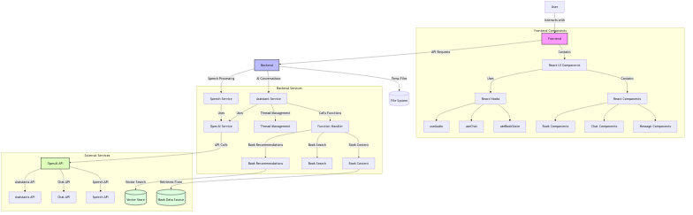
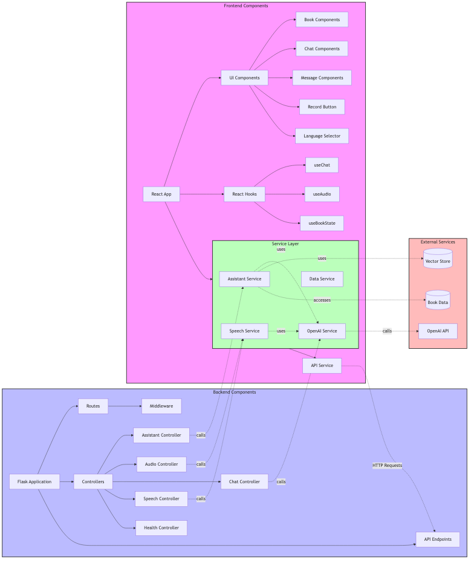
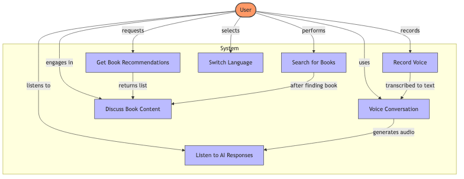
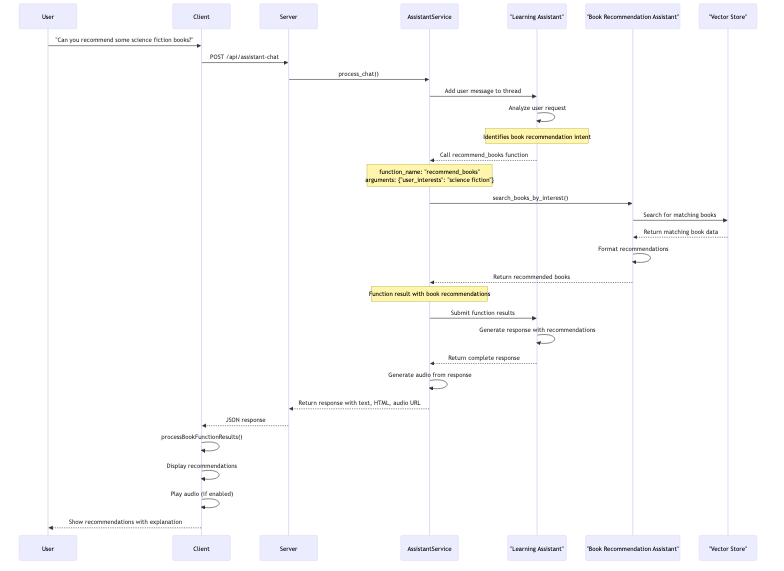

# Pickatale AI Reading Assistant

A voice analysis and conversation platform supporting voice input, text interaction, and intelligent responses.

## Project Overview

PT Reading Voice Analysis is an application that combines speech recognition, natural language processing, and text-to-speech conversion technologies to analyze voice input and provide intelligent conversation capabilities. The project consists of a React frontend and a Flask backend, leveraging OpenAI's API including the Assistant API for advanced conversation features and book-related functionalities.

### System Architecture



The architecture diagram above shows the main components of the system and how they interact with each other.

### Component Diagram



This diagram illustrates the relationships between different components in both frontend and backend.

### Use Case Diagram



The use case diagram shows the primary interactions users can have with the system.

### Key Features

- **Voice Input Analysis**: Record and analyze spoken content
- **Book Recommendations**: Get personalized book recommendations based on interests
- **Book Search**: Find books by title with intelligent matching
- **Book Content Retrieval**: Access and discuss specific book content
- **Intelligent Conversations**: Engage with AI about reading materials and more
- **Voice Responses**: Convert AI responses to natural-sounding speech
- **Multi-language Support**: Toggle between English and Chinese interfaces
- **Real-time Updates**: Stream-based responses for responsive user experience
- **Content Moderation**: Ensures all content is appropriate

## Project Structure

```
pt-reading-voice-analysis/
├── cache/                  # Cache files directory
├── client/                 # Frontend code
│   ├── public/             # Static resources
│   │   └── index.html      # Main HTML page
│   ├── src/                # Source code
│   │   ├── components/     # React components
│   │   │   ├── ChatInterface.jsx    # Chat interface component
│   │   │   ├── LanguageSelector.jsx # Language selector component
│   │   │   └── RecordButton.jsx     # Recording button component
│   │   ├── i18n/           # Internationalization resources
│   │   │   └── locales/    # Language packs
│   │   │       ├── en.json # English translations
│   │   │       └── zh.json # Chinese translations
│   │   ├── services/       # Services
│   │   │   └── api.js      # API call service
│   │   ├── styles/         # Style files
│   │   │   └── styles.css  # Main stylesheet
│   │   ├── App.js          # Main React application
│   │   └── index.js        # Entry point
│   ├── package.json        # Frontend dependencies and scripts
│   └── package-lock.json   # Lock file for dependencies
├── server/                 # Backend code
│   ├── controllers/        # API controllers
│   │   ├── assistant_controller.py   # OpenAI assistant controller
│   │   ├── audio_controller.py       # Audio processing controller
│   │   ├── chat_controller.py        # Chat functionality controller
│   │   ├── health_controller.py      # Health check endpoint
│   │   ├── speech_controller.py      # Speech processing controller
│   │   └── tts_controller.py         # Text-to-speech controller
│   ├── libs/               # Library modules
│   │   ├── data_source.py         # Data source management
│   │   ├── openai_assistant.py    # OpenAI assistant integration
│   │   └── prompt_templates.py    # Prompt templates for AI
│   ├── services/           # Backend services
│   │   └── openai_service.py      # OpenAI API service
│   ├── app.py              # Main Flask application
│   ├── config.py           # Configuration settings
│   ├── routes.py           # API route definitions
│   ├── requirements.txt    # Python dependencies
│   └── .env.sample         # Sample environment variables
├── reference/              # Reference materials and scripts
│   └── run_task.py         # Helper script for tasks
├── run.sh                  # Project starter script
└── README.md               # This documentation file
```

## Prerequisites

Before running the application, make sure you have the following installed:

- Python 3.x
- Node.js and npm
- OpenAI API key

## Setup Instructions

1. Clone the repository:
   ```bash
   git clone <repository-url>
   cd pt-reading-voice-analysis
   ```

2. Set up the environment:
   - Copy the sample environment file and update it with your OpenAI API key:
     ```bash
     cp server/.env.sample server/.env
     ```
   - Edit the `.env` file to add your OpenAI API key:
     ```
     OPENAI_API_KEY=your_api_key_here
     ```

3. The `run.sh` script will handle the rest of the setup process automatically, including:
   - Creating a Python virtual environment
   - Installing backend dependencies
   - Installing frontend dependencies

## Running the Application

The project includes a convenient script that can start both frontend and backend components in either development or production mode.

### Development Mode (Default)

```bash
./run.sh
```

Or explicitly specify development mode:

```bash
./run.sh dev
```

In development mode:
- Backend runs with debug mode enabled
- Frontend uses Parcel's development server with hot reloading

### Production Mode

```bash
./run.sh prod
```

In production mode:
- Backend runs with debug mode disabled
- Frontend builds optimized assets and serves them with a static server

### Access the Application

Once running, you can access:
- Backend API: `http://localhost:8000`
- Frontend (development): `http://localhost:1234`
- Frontend (production): `http://localhost:3000`

## Features

- **Voice Recording**: Record voice input for analysis
- **Speech-to-Text**: Convert spoken language to text
- **Intelligent Conversation**: Chat with an AI assistant
- **Text-to-Speech**: Convert text responses to speech
- **Multilingual Support**: Toggle between English and Chinese interfaces
- **Voice Analysis**: Analyze speech patterns and characteristics

## API Endpoints

### Basic Endpoints
- `/api/health`: Health check endpoint
- `/api/chat`: Text-based chat interaction
- `/api/chat/reset`: Reset chat history
- `/api/speech-to-text`: Convert speech to text
- `/api/text-to-speech`: Convert text to speech
- `/api/audio/{filename}`: Retrieve generated audio files

### Assistant API Endpoints
- `/api/assistant-chat`: Process chat messages using OpenAI Assistant API
- `/api/assistant-chat-stream`: Stream responses in real-time using Server-Sent Events (SSE)

## Documentation

Detailed documentation is available in the following files:
- [Server API Documentation](docs/server-api.md) - Complete reference for all backend API endpoints, request/response formats, and features
- [Client API Documentation](docs/client-api.md) - Comprehensive guide to frontend APIs, React hooks, and client-side functionality
- [AI Assistant Documentation](docs/ai-assistant.md) - Detailed explanation of OpenAI Assistant integration, function calls, and business logic flows

## Business Logic Flows

### Book Recommendation Flow



The diagram above illustrates the process of recommending books based on user interests.

### Book Discussion Flow


This diagram shows how users can discuss specific book content through the system.

### Real-time Streaming Response


This diagram illustrates how the system delivers real-time responses using Server-Sent Events.

## Assistant Service Functionality

### Overview
The application uses OpenAI's Assistant API to provide advanced conversation capabilities beyond basic chat. The Assistant service manages user sessions, processes messages, handles function calls, and delivers responses in both standard and streaming formats.

### Key Assistant Features

#### Book Recommendations
The system can analyze user interests and recommend relevant books.
```
Example: "Could you recommend some science fiction books?"
```

#### Book Search
Users can search for books by title, with the system finding the closest matches.
```
Example: "I'm looking for a book called 'Pride and Prejudice'"
```

#### Book Content Retrieval
The system can access and discuss content from specific books in its database.
```
Example: "Let's talk about The Great Gatsby"
```

### Stream-Based Responses
The Assistant supports Server-Sent Events (SSE) for real-time streaming responses, providing:
- Status updates during processing
- Progress indicators for function calls
- Incremental response delivery

### Content Moderation
All user inputs are automatically checked for appropriateness. Content that might be unsuitable receives a friendly warning response instead of the requested information.

### Session Management
The Assistant maintains conversation context through persistent user threads, allowing for coherent multi-turn conversations about complex topics.

## Utility Scripts and Testing

### Book Content Fetcher

The project includes a utility script to fetch book content directly from the command line:

```bash
# From the project root directory:
cd server
./fetch_book.py <book_id>

# Or alternatively:
python server/fetch_book.py <book_id>
```

**Features:**

- Retrieves book details using the provided book ID
- Displays title, description, and a preview of the content
- Offers to save the full content to a text file
- Validates input and provides helpful error messages

**Example usage:**

```bash
./fetch_book.py 12550-1
```

This will fetch and display information for the book with ID "12550-1". The script currently supports test book IDs: 12550-1, 2590-3, and 2940-5.

### Testing the Data Source Module

The project includes comprehensive tests for the `fetch_book_content()` function:

```bash
# From the project root directory:
cd server
python -m pytest tests/ -v
```

**Test Features:**

- Unit tests for book content retrieval functionality
- Tests all supported book IDs: 12550-1, 2590-3, and 2940-5
- Validates data structure and content of responses
- Tests error handling for invalid book IDs and database issues
- Uses mocks to avoid actual database connections during testing

Test files are located in the `server/tests/` directory:
- `test_data_source.py`: Contains the actual test cases
- `conftest.py`: Contains pytest configuration
- `README.md`: Detailed documentation about the tests

## Troubleshooting

If you encounter any issues:

1. Ensure your OpenAI API key is correctly set in the `.env` file
2. Check that all required dependencies are installed
3. Verify that both frontend and backend are running
4. Check the terminal output for any error messages

## Stopping the Application

To stop all running components, press `Ctrl+C` in the terminal where you started the application. The script will gracefully shut down all processes.
