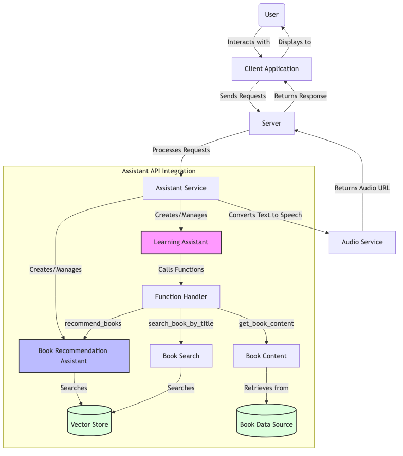
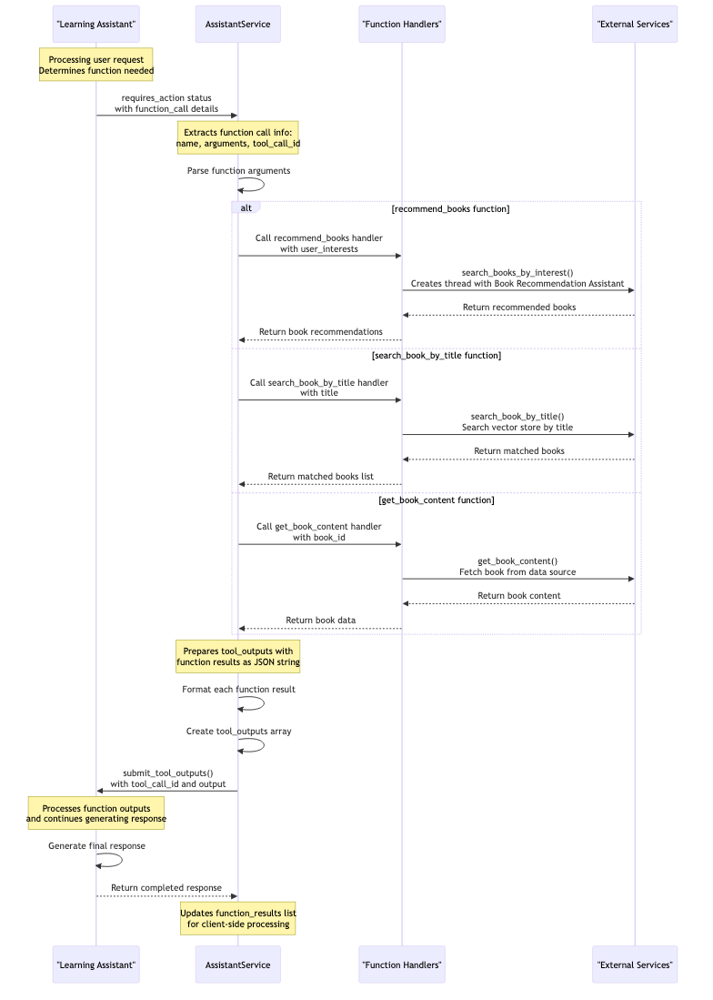
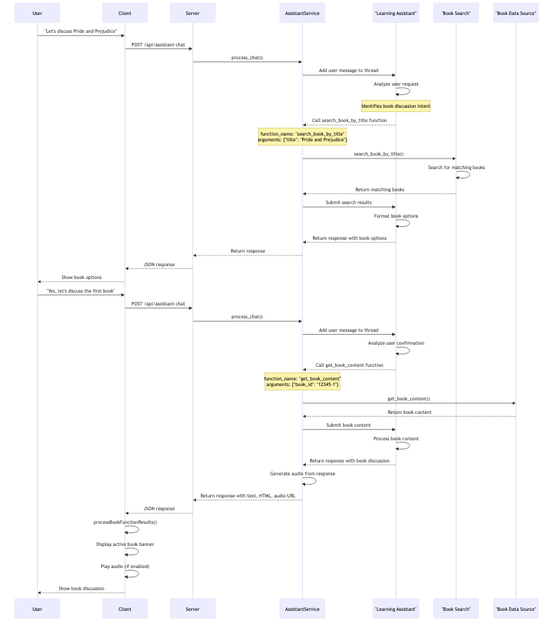

# PT Reading Voice Analysis - AI Assistant Integration

## Table of Contents
- [Overview](#overview)
- [Assistant Types](#assistant-types)
- [Function Calls Architecture](#function-calls-architecture)
- [Business Logic Flows](#business-logic-flows)
- [Extending the System](#extending-the-system)

## Overview

The PT Reading Voice Analysis application uses OpenAI's Assistant API to provide intelligent conversation capabilities centered around book discussions and recommendations. This document details how the AI Assistant integration works, the function calls used to extend its capabilities, and the business logic flows that drive the application.



## Assistant Types

The application uses two primary Assistant configurations:

### 1. Learning Assistant

**Purpose**: Serves as the main conversational interface for users, handling general inquiries and book discussions.

**Initialization**:
```python
assistant = client.beta.assistants.create(
    name="Learning Assistant",
    instructions=OPENAI_ASSISTANT_INSTRUCTION,
    model=OPENAI_MODEL,
    tools=[
        {"type": "function", "function": {"name": "recommend_books", ...}},
        {"type": "function", "function": {"name": "search_book_by_title", ...}},
        {"type": "function", "function": {"name": "get_book_content", ...}}
    ]
)
```

**Key Capabilities**:
- Personalized learning assistance
- Book content discussions
- Book recommendations
- Book search by title
- Language adaptation (matches user's language)

### 2. Book Recommendation Assistant

**Purpose**: Specialized assistant focused on book recommendations using vector search.

**Initialization**:
```python
assistant = client.beta.assistants.create(
    name="Book Recommendation Assistant",
    instructions=OPENAI_BOOK_RECOMMENDER_ASSISTANT_INSTRUCTION,
    model=OPENAI_MODEL,
    tools=[
        {"type": "file_search"},
        {"type": "function", "function": {"name": "recommend_books_from_vector_store", ...}}
    ],
    tool_resources={"file_search": {"vector_store_ids": [vector_store_id]}}
)
```

**Key Capabilities**:
- Vector store search for books
- Understanding user reading preferences
- Contextual book recommendations
- Analysis of user interests

## Function Calls Architecture

The application defines several function calls that extend the Assistant's capabilities:



### 1. recommend_books

**Purpose**: Analyzes user interests to recommend books.

**Function Definition**:
```python
{
    "name": "recommend_books",
    "description": "Helps users find book recommendations based on their reading preferences.",
    "parameters": {
        "type": "object",
        "properties": {
            "user_interests": {
                "type": "string",
                "description": "Summary of user's reading interests based on conversation"
            }
        },
        "required": ["user_interests"]
    }
}
```

**Business Logic Flow**:
1. The Assistant analyzes the conversation to understand user's reading interests
2. It calls the `recommend_books` function with a summary of those interests
3. The backend processes this call in `_execute_function` within `AssistantService`
4. The backend then calls `search_books_by_interest` from the OpenAI Assistant library
5. The function uses the Book Recommendation Assistant to find matching books
6. Results are returned to the main Assistant and presented to the user

**Implementation Details**:
```python
def _execute_function(self, function_name: str, function_args: Dict[str, Any]) -> Dict[str, Any]:
    if function_name == "recommend_books":
        user_interests = function_args.get("user_interests", "")
        book_recommendation_assistant_id = current_app.config.get('BOOK_RECOMMANDATION_ASSISTANT_ID')

        from libs import openai_assistant as oa
        recommended_books = oa.search_books_by_interest(
            book_recommendation_assistant_id,
            user_interests
        )

        return {"status": "success", "recommended_books": recommended_books}
```

### 2. search_book_by_title

**Purpose**: Searches for books by title to find specific books a user wants to discuss.

**Function Definition**:
```python
{
    "name": "search_book_by_title",
    "description": "Searches for books by title to find book IDs.",
    "parameters": {
        "type": "object",
        "properties": {
            "title": {
                "type": "string",
                "description": "Book title mentioned by the user"
            }
        },
        "required": ["title"]
    }
}
```

**Business Logic Flow**:
1. When a user mentions wanting to discuss a specific book, the Assistant extracts the title
2. It calls `search_book_by_title` with the book title
3. The backend retrieves the Book Recommendation Assistant's vector store ID
4. It uses `search_book_by_title` from the OpenAI Assistant library to search for matching books
5. Matching books are returned to the Assistant and presented to the user

**Implementation Details**:
```python
def _execute_function(self, function_name: str, function_args: Dict[str, Any]) -> Dict[str, Any]:
    if function_name == "search_book_by_title":
        title = function_args.get("title", "")
        book_recommendation_assistant_id = current_app.config.get('BOOK_RECOMMANDATION_ASSISTANT_ID')

        # Get vector_store_id from the assistant
        from libs import openai_assistant as oa
        client = openai.OpenAI()
        assistant = client.beta.assistants.retrieve(book_recommendation_assistant_id)

        if assistant.tool_resources and assistant.tool_resources.file_search:
            vector_store_ids = assistant.tool_resources.file_search.vector_store_ids
            if vector_store_ids:
                vector_store_id = vector_store_ids[0]
                matched_books = oa.search_book_by_title(vector_store_id, title)
                return {"status": "success", "matched_books": matched_books}

        return {"status": "error", "matched_books": []}
```

### 3. get_book_content

**Purpose**: Retrieves the full content of a book to enable in-depth discussions.

**Function Definition**:
```python
{
    "name": "get_book_content",
    "description": "Retrieves the full content of a book by its ID.",
    "parameters": {
        "type": "object",
        "properties": {
            "book_id": {
                "type": "string",
                "description": "Unique identifier for the book"
            }
        },
        "required": ["book_id"]
    }
}
```

**Business Logic Flow**:
1. When a user wants to discuss a specific book (either directly by ID or after searching by title)
2. The Assistant calls `get_book_content` with the book ID
3. The backend calls `get_book_content` from the OpenAI Assistant library
4. The function retrieves book data from a local data source (`data_source.py`)
5. The book content is returned to the Assistant which can now discuss specifics about the book

**Implementation Details**:
```python
def _execute_function(self, function_name: str, function_args: Dict[str, Any]) -> Dict[str, Any]:
    if function_name == "get_book_content":
        book_id = function_args.get("book_id", "")

        from libs import openai_assistant as oa
        book_data = oa.get_book_content(book_id)

        if book_data:
            return {"status": "success", "book": book_data}
        else:
            return {"status": "not_found", "book": None}
```

## Business Logic Flows

The following sections describe the key business logic flows in the system, illustrated with sequence diagrams.

### User Book Discussion Flow



1. **Book Mention**: User mentions wanting to discuss a specific book
   - Example: "I'd like to discuss Pride and Prejudice"

2. **Title Search**: Assistant recognizes the intention and calls `search_book_by_title`
   ```json
   {
     "name": "search_book_by_title",
     "arguments": {
       "title": "Pride and Prejudice"
     }
   }
   ```

3. **Book Selection**: Assistant receives matching books and prompts user to confirm
   - Example: "I found these books matching 'Pride and Prejudice'. Which one would you like to discuss?"

4. **Content Retrieval**: When user confirms, Assistant calls `get_book_content`
   ```json
   {
     "name": "get_book_content",
     "arguments": {
       "book_id": "12345-1"
     }
   }
   ```

5. **Book Discussion**: Assistant now has the book content and can discuss specifics
   - Example: "Pride and Prejudice is a novel by Jane Austen published in 1813. What aspects would you like to discuss?"

6. **Client-Side Interaction**: The client displays an active book banner via the `useBookState` hook
   ```javascript
   processBookFunctionResults(functionResults) {
     for (const func of functionResults) {
       if (func.name === 'get_book_content' && func.result && func.result.status === 'success') {
         setActiveBook({
           book_id: func.result.book.book_id,
           book_title: func.result.book.book_title
         });
       }
     }
   }
   ```

### Book Recommendation Flow


1. **Interest Expression**: User expresses interest in certain types of books
   - Example: "Can you recommend some science fiction books for teenagers?"

2. **Interest Analysis**: Assistant analyzes the request and calls `recommend_books`
   ```json
   {
     "name": "recommend_books",
     "arguments": {
       "user_interests": "science fiction for teenage readers"
     }
   }
   ```

3. **Vector Search**: Backend uses the Book Recommendation Assistant to search the vector store

4. **Recommendation Process**:
   - The `search_books_by_interest` function creates a thread with the Book Recommendation Assistant
   - It formats a prompt using the user's interests
   - The Book Recommendation Assistant uses file_search to find matching books
   - It then calls `recommend_books_from_vector_store` to format the results

5. **Response Presentation**: Assistant receives recommendations and presents them to user
   - Example: "Based on your interest in science fiction for teenagers, I recommend these books..."

6. **Client-Side Display**: The client displays book recommendations using the `BookRecommendations` component
   ```javascript
   if (response.function_results && response.function_results.length > 0) {
     processBookFunctionResults(response.function_results);
   }
   ```

### Real-time Response Flow (SSE)


For enhanced user experience, the system implements Server-Sent Events (SSE) for streaming responses:

1. **SSE Connection**: Client establishes SSE connection when sending a message
   ```javascript
   const sendTextMessageWithSSE = (message, onStatusUpdate) => {
     return new Promise((resolve, reject) => {
       const eventSource = new EventSource(`${API_BASE_URL}/assistant-chat-stream?message=${encodedMessage}`);

       eventSource.addEventListener('status', (event) => {
         const statusData = JSON.parse(event.data);
         onStatusUpdate(statusData.status);
       });

       // More event listeners...
     });
   }
   ```

2. **Status Updates**: Backend sends real-time status updates during processing
   ```python
   def chat_stream(self, message: str, session_id: str = 'default_user', language: str = 'en'):
       # Format SSE message helper
       def format_sse(event, data):
           return f"event: {event}\ndata: {json.dumps(data)}\n\n"

       # Send status updates
       yield format_sse("status", {"status": "Analyzing your request..."})
       # More processing...
   ```

3. **Function Call Progress**: When function calls occur, specific progress updates are sent
   ```python
   yield format_sse("progress", {
       "status": f"Processing {function_type}...",
       "progress": {
           "type": function_type,
           "icon": self._get_function_icon(function_type)
       }
   })
   ```

4. **Response Completion**: When processing completes, the full response is sent
   ```python
   yield format_sse("complete", reply)
   ```

5. **Client Rendering**: Client processes these events to update the UI in real-time
   ```javascript
   handleStatusUpdate = (statusMsg, progress = null) => {
     setStatus(statusMsg);
     if (progress !== null) {
       setProcessingSteps(prev => {
         // Update processing steps display
       });
     }
   };
   ```

## Extending the System

### Adding New Functions

To add new functions to the Assistant:

1. **Define the function** in the Assistant creation:
   ```python
   {
     "type": "function",
     "function": {
       "name": "new_function_name",
       "description": "Description of what the function does",
       "parameters": {
         "type": "object",
         "properties": {
           "param1": {
             "type": "string",
             "description": "Description of parameter"
           }
         },
         "required": ["param1"]
       }
     }
   }
   ```

2. **Implement the function handler** in `_execute_function` in `AssistantService`:
   ```python
   def _execute_function(self, function_name: str, function_args: Dict[str, Any]) -> Dict[str, Any]:
       # Existing function handlers...

       elif function_name == "new_function_name":
           param1 = function_args.get("param1", "")
           # Implement function logic
           result = self._your_implementation(param1)
           return {"status": "success", "data": result}
   ```

3. **Add client-side handling** in the appropriate React component:
   ```javascript
   if (response.function_results && response.function_results.length > 0) {
     for (const result of response.function_results) {
       if (result.name === "new_function_name" && result.result.status === "success") {
         // Handle the result in the UI
       }
     }
   }
   ```

### Creating a New Assistant Type

To create a new specialized Assistant:

1. **Define the Assistant instructions** in `openai_assistant.py`:
   ```python
   NEW_ASSISTANT_INSTRUCTION = """
   Detailed instructions for the new assistant type.
   """
   ```

2. **Create an initialization function**:
   ```python
   def ensure_new_assistant_type() -> str:
       assistant = client.beta.assistants.create(
           name="New Assistant Type",
           instructions=NEW_ASSISTANT_INSTRUCTION,
           model=OPENAI_MODEL,
           tools=[
               # Define appropriate tools
           ]
       )
       return assistant.id
   ```

3. **Update the Assistant service** to use the new Assistant type when appropriate.

### Improving Vector Search

To enhance the book recommendation system:

1. **Expand the vector store** with more book data:
   ```python
   def update_vector_store(vector_store_id: str, new_library_data_path: str) -> None:
       # Upload and link new data to the vector store
       with open(new_library_data_path, "rb") as file:
           uploaded_file = client.files.create(file=file, purpose="assistants")
           file_id = uploaded_file.id

       client.vector_stores.files.create(vector_store_id=vector_store_id, file_id=file_id)
   ```

2. **Improve search prompts** for better matching:
   ```python
   IMPROVED_USER_RECOMMENDATION_PROMPT = """
   More detailed prompt with specific aspects to consider for recommendations.
   """
   ```

3. **Add relevance scoring** to better rank recommendations:
   ```python
   def rank_recommendations(books, user_interests):
       # Implement relevance scoring algorithm
       # Return sorted books by relevance
