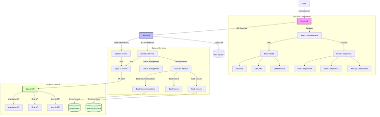
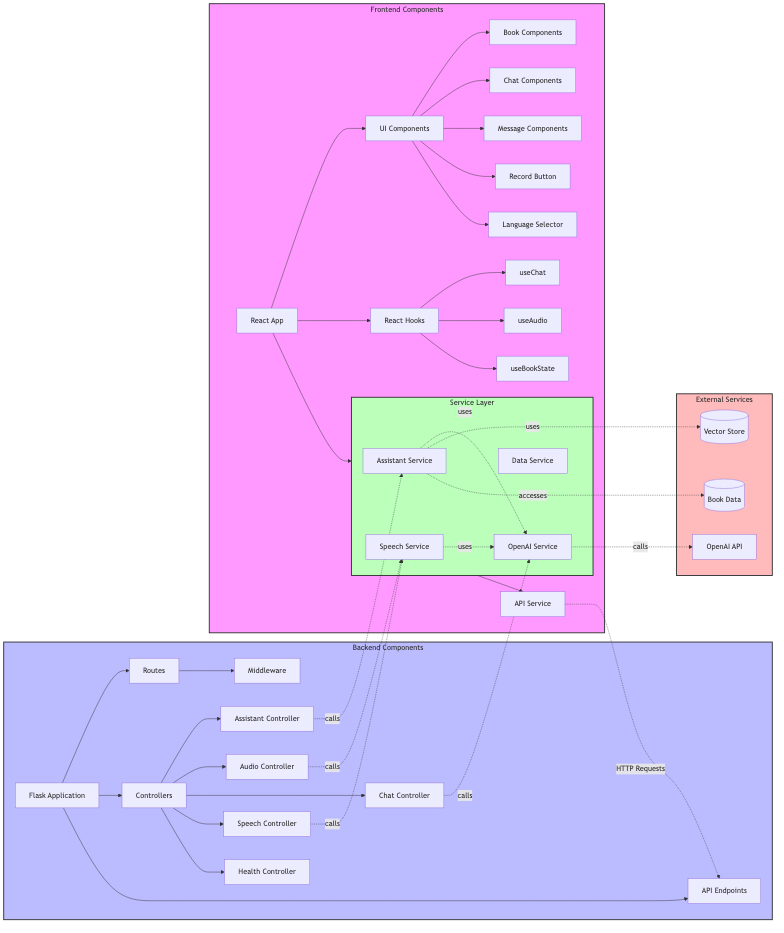
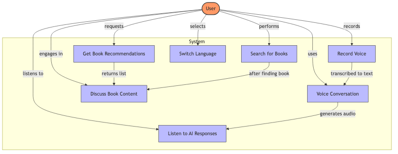
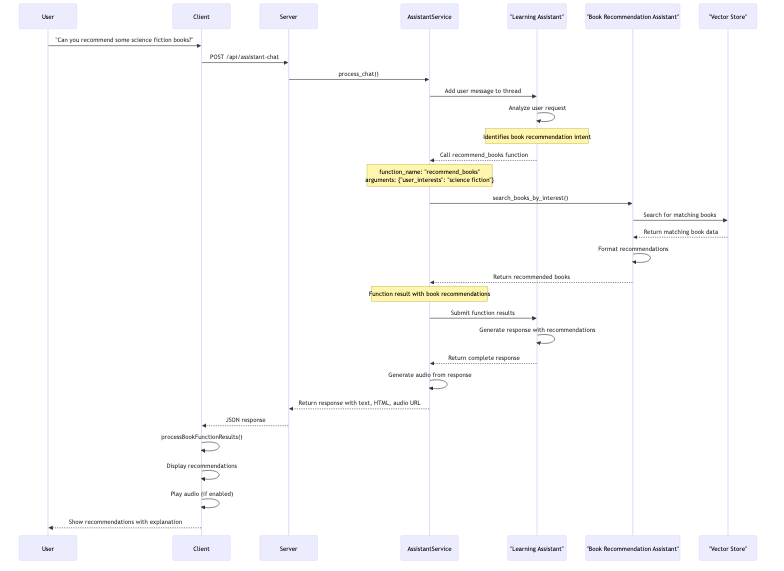
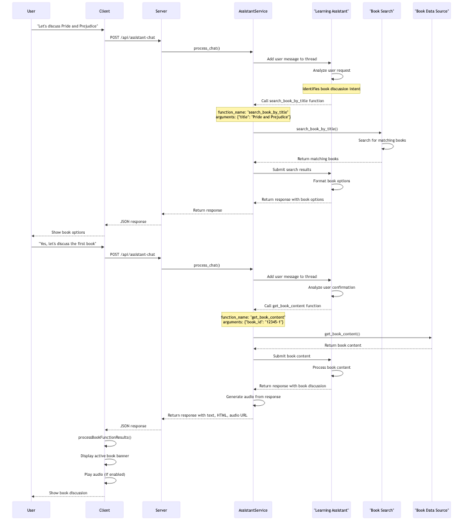
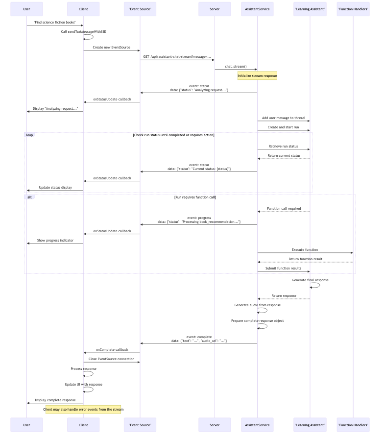
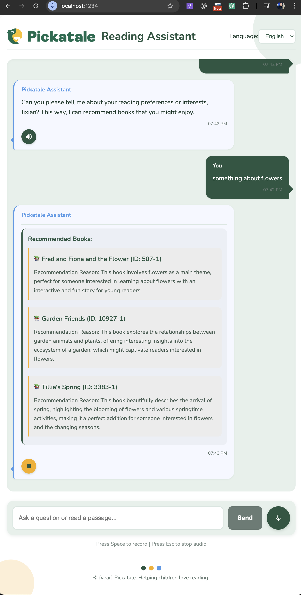
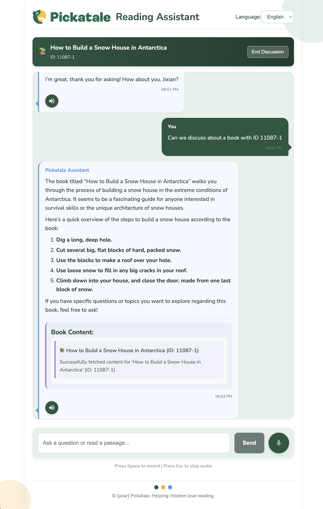

# Pickatale AI Reading Assistant

A voice analysis and conversation platform supporting voice input, text interaction, and intelligent responses.

## 目录
- [项目概述](#project-overview)
  - [系统架构](#system-architecture)
  - [组件图](#component-diagram)
  - [用例图](#use-case-diagram)
  - [主要功能](#key-features)
- [项目结构](#project-structure)
- [前提条件](#prerequisites)
- [设置说明](#setup-instructions)
- [运行应用程序](#running-the-application)
- [功能特性](#features)
- [API端点](#api-endpoints)
- [业务逻辑流程](#business-logic-flows)
- [助手服务功能](#assistant-service-functionality)
- [实用脚本和测试](#utility-scripts-and-testing)
- [故障排除](#troubleshooting)
- [停止应用程序](#stopping-the-application)
- [应用截图](#application-screenshots)
- [详细API文档](#detailed-api-documentation)
  - [服务器API文档](#server-api-documentation)
  - [客户端API文档](#client-api-documentation)

## Project Overview

Pickatale AI Reading Assistant is an application that combines speech recognition, natural language processing, and text-to-speech conversion technologies to analyze voice input and provide intelligent conversation capabilities. The project consists of a React frontend and a Flask backend, leveraging OpenAI's API including the Assistant API for advanced conversation features and book-related functionalities.

### System Architecture



The architecture diagram above shows the main components of the system and how they interact with each other.

### Component Diagram



This diagram illustrates the relationships between different components in both frontend and backend.

### Use Case Diagram



The use case diagram shows the primary interactions users can have with the system.

### Key Features

- **Voice Input Analysis**: Record and analyze spoken content
- **Book Recommendations**: Get personalized book recommendations based on interests
- **Book Search**: Find books by title with intelligent matching
- **Book Content Retrieval**: Access and discuss specific book content
- **Intelligent Conversations**: Engage with AI about reading materials and more
- **Voice Responses**: Convert AI responses to natural-sounding speech
- **Multi-language Support**: Toggle between English and Chinese interfaces
- **Real-time Updates**: Stream-based responses for responsive user experience
- **Content Moderation**: Ensures all content is appropriate

## Project Structure

```
pickatale-ai-reading-assistant/
├── cache/                  # Cache files directory
├── client/                 # Frontend code
│   ├── public/             # Static resources
│   │   └── index.html      # Main HTML page
│   ├── src/                # Source code
│   │   ├── components/     # React components
│   │   │   ├── ChatInterface.jsx    # Chat interface component
│   │   │   ├── LanguageSelector.jsx # Language selector component
│   │   │   └── RecordButton.jsx     # Recording button component
│   │   ├── i18n/           # Internationalization resources
│   │   │   └── locales/    # Language packs
│   │   │       ├── en.json # English translations
│   │   │       └── zh.json # Chinese translations
│   │   ├── services/       # Services
│   │   │   └── api.js      # API call service
│   │   ├── styles/         # Style files
│   │   │   └── styles.css  # Main stylesheet
│   │   ├── App.js          # Main React application
│   │   └── index.js        # Entry point
│   ├── package.json        # Frontend dependencies and scripts
│   └── package-lock.json   # Lock file for dependencies
├── server/                 # Backend code
│   ├── controllers/        # API controllers
│   │   ├── assistant_controller.py   # OpenAI assistant controller
│   │   ├── audio_controller.py       # Audio processing controller
│   │   ├── chat_controller.py        # Chat functionality controller
│   │   ├── health_controller.py      # Health check endpoint
│   │   ├── speech_controller.py      # Speech processing controller
│   │   └── tts_controller.py         # Text-to-speech controller
│   ├── libs/               # Library modules
│   │   ├── data_source.py         # Data source management
│   │   ├── openai_assistant.py    # OpenAI assistant integration
│   │   └── prompt_templates.py    # Prompt templates for AI
│   ├── services/           # Backend services
│   │   └── openai_service.py      # OpenAI API service
│   ├── app.py              # Main Flask application
│   ├── config.py           # Configuration settings
│   ├── routes.py           # API route definitions
│   ├── requirements.txt    # Python dependencies
│   └── .env.sample         # Sample environment variables
├── reference/              # Reference materials and scripts
│   └── run_task.py         # Helper script for tasks
├── run.sh                  # Project starter script
└── README.md               # This documentation file
```

## Prerequisites

Before running the application, make sure you have the following installed:

- Python 3.x
- Node.js and npm
- OpenAI API key

## Setup Instructions

1. Clone the repository:
   ```bash
   git clone <repository-url>
   cd pickatale-ai-reading-assistant
   ```

2. Set up the environment:
   - Copy the sample environment file and update it with your OpenAI API key:
     ```bash
     cp server/.env.sample server/.env
     ```
   - Edit the `.env` file to add your OpenAI API key:
     ```
     OPENAI_API_KEY=your_api_key_here
     ```

3. The `run.sh` script will handle the rest of the setup process automatically, including:
   - Creating a Python virtual environment
   - Installing backend dependencies
   - Installing frontend dependencies

## Running the Application

The project includes a convenient script that can start both frontend and backend components in either development or production mode.

### Development Mode (Default)

```bash
./run.sh
```

Or explicitly specify development mode:

```bash
./run.sh dev
```

In development mode:
- Backend runs with debug mode enabled
- Frontend uses Parcel's development server with hot reloading

### Production Mode

```bash
./run.sh prod
```

In production mode:
- Backend runs with debug mode disabled
- Frontend builds optimized assets and serves them with a static server

### Access the Application

Once running, you can access:
- Backend API: `http://localhost:8000`
- Frontend (development): `http://localhost:1234`
- Frontend (production): `http://localhost:3000`

## Features

- **Voice Recording**: Record voice input for analysis
- **Speech-to-Text**: Convert spoken language to text
- **Intelligent Conversation**: Chat with an AI assistant
- **Text-to-Speech**: Convert text responses to speech
- **Multilingual Support**: Toggle between English and Chinese interfaces
- **Voice Analysis**: Analyze speech patterns and characteristics

## API Endpoints

### Basic Endpoints
- `/api/health`: Health check endpoint
- `/api/chat`: Text-based chat interaction
- `/api/chat/reset`: Reset chat history
- `/api/speech-to-text`: Convert speech to text
- `/api/text-to-speech`: Convert text to speech
- `/api/audio/{filename}`: Retrieve generated audio files

### Assistant API Endpoints
- `/api/assistant-chat`: Process chat messages using OpenAI Assistant API
- `/api/assistant-chat-stream`: Stream responses in real-time using Server-Sent Events (SSE)

## Business Logic Flows

### Book Recommendation Flow



The diagram above illustrates the process of recommending books based on user interests.

### Book Discussion Flow



This diagram shows how users can discuss specific book content through the system.

### Real-time Streaming Response



This diagram illustrates how the system delivers real-time responses using Server-Sent Events.

## Assistant Service Functionality

### Overview
The application uses OpenAI's Assistant API to provide advanced conversation capabilities beyond basic chat. The Assistant service manages user sessions, processes messages, handles function calls, and delivers responses in both standard and streaming formats.

### Key Assistant Features

#### Book Recommendations
The system can analyze user interests and recommend relevant books.
```
Example: "Could you recommend some science fiction books?"
```

#### Book Search
Users can search for books by title, with the system finding the closest matches.
```
Example: "I'm looking for a book called 'Pride and Prejudice'"
```

#### Book Content Retrieval
The system can access and discuss content from specific books in its database.
```
Example: "Let's talk about The Great Gatsby"
```

### Stream-Based Responses
The Assistant supports Server-Sent Events (SSE) for real-time streaming responses, providing:
- Status updates during processing
- Progress indicators for function calls
- Incremental response delivery

### Content Moderation
All user inputs are automatically checked for appropriateness. Content that might be unsuitable receives a friendly warning response instead of the requested information.

### Session Management
The Assistant maintains conversation context through persistent user threads, allowing for coherent multi-turn conversations about complex topics.

## Utility Scripts and Testing

### Book Content Fetcher

The project includes a utility script to fetch book content directly from the command line:

```bash
# From the project root directory:
cd server
./fetch_book.py <book_id>

# Or alternatively:
python server/fetch_book.py <book_id>
```

**Features:**

- Retrieves book details using the provided book ID
- Displays title, description, and a preview of the content
- Offers to save the full content to a text file
- Validates input and provides helpful error messages

**Example usage:**

- Uses mocks to avoid actual database connections during testing

Test files are located in the `server/tests/` directory:
- `test_data_source.py`: Contains the actual test cases
- `conftest.py`: Contains pytest configuration
- `README.md`: Detailed documentation about the tests

## Troubleshooting

If you encounter any issues:

1. Ensure your OpenAI API key is correctly set in the `.env` file
2. Check that all required dependencies are installed
3. Verify that both frontend and backend are running
4. Check the terminal output for any error messages

## Stopping the Application

To stop all running components, press `Ctrl+C` in the terminal where you started the application. The script will gracefully shut down all processes.

## Application Screenshots

Below are screenshots of the Pickatale AI Reading Assistant application in action:

### Main Interface



The main interface shows the chat interface with the AI assistant, providing options for voice input and book discussion.

### Book Recommendation View



The book recommendation view displays personalized book recommendations based on the user's interests with detailed descriptions and reasons.

# Detailed API Documentation

## Server API Documentation

### Base URL

All API paths are based on the following base URL:
```
http://localhost:8000
```

### Health Check

#### Get System Health Status

```
GET /api/health
```

Checks if the service is running properly.

**Response Example:**
```json
{
  "status": "healthy",
  "version": "1.0.0",
  "message": "Service is running normally"
}
```

### Voice Services

#### Speech-to-Text

```
POST /api/speech-to-text
```

Converts an audio file to text.

**Request Parameters:**
- `audio`: Audio file (form data)

**Supported Audio Formats:**
- MP3 (.mp3)
- WAV (.wav)
- OGG (.ogg)
- WebM (.webm)

**Response Example:**
```json
{
  "text": "This is the transcribed text content from the audio"
}
```

#### Text-to-Speech

```
POST /api/text-to-speech
```

Converts text to speech and returns an audio URL.

**Request Parameters:**
- `text`: Text content to convert to speech
- `voice` (optional): Voice type, default is "alloy"

**Available Voice Types:**
- alloy
- echo
- fable
- onyx
- nova
- shimmer

**Request Example:**
```json
{
  "text": "Hello, world!",
  "voice": "nova"
}
```

**Response Example:**
```json
{
  "audio_url": "/api/audio/abc123.mp3"
}
```

#### Get Audio File

```
GET /api/audio/{filename}
```

Retrieves an audio file generated by the text-to-speech function.

**Path Parameters:**
- `filename`: Audio filename

**Response:**
- Audio file (MIME type: audio/mpeg)

### Chat Services

#### Send Chat Message

```
POST /api/chat
```

Sends a message and receives an AI response.

**Request Parameters:**
- `message`: User message content
- `language` (optional): Language code, "en" or "zh", default is "en"

**Request Example:**
```json
{
  "message": "Hello, who am I?",
  "language": "en"
}
```

**Response Example:**
```json
{
  "text": "Hello! You are a user, and I am an AI assistant.",
  "audio_url": "/api/audio/abc123.mp3"
}
```

#### Reset Chat History

```
POST /api/chat/reset
```

Clears the current chat history.

**Response Example:**
```json
{
  "status": "success",
  "message": "Chat history has been reset"
}
```

### Assistant Services

The Assistant services are based on OpenAI's Assistant API, providing more advanced conversation capabilities, including book recommendations, book search, etc.

#### Send Assistant Chat Message

```
POST /api/assistant-chat
```

Sends a message to OpenAI Assistant and receives a response.

**Request Parameters:**
- `message`: User message content
- `language` (optional): Language code, "en" or "zh", default is "en"

**Request Example:**
```json
{
  "message": "Please recommend some adventure books",
  "language": "en"
}
```

**Response Example:**
```json
{
  "text": "Here are some adventure books recommendations...",
  "audio_url": "/api/audio/abc123.mp3",
  "function_results": [
    {
      "name": "recommend_books",
      "arguments": {
        "user_interests": "adventure novels"
      },
      "result": {
        "status": "success",
        "recommended_books": [
          {
            "book_id": "12345",
            "book_title": "Twenty Thousand Leagues Under the Sea",
            "reason": "This is a classic adventure novel"
          }
        ]
      }
    }
  ]
}
```

#### Streaming Assistant Chat

```
GET /api/assistant-chat-stream?message={message}&language={language}
```

Receives Assistant responses as a Server-Sent Events (SSE) stream, suitable for real-time UI updates.

**Query Parameters:**
- `message`: User message content (URL encoded)
- `language` (optional): Language code, "en" or "zh", default is "en"

**Response:**
Server-Sent Events (SSE) stream containing the following event types:
- `status`: Processing status updates
- `progress`: Progress updates (e.g., function call process)
- `complete`: Completed response
- `error`: Error messages

**Event Examples:**
```
event: status
data: {"status": "Thinking..."}

event: progress
data: {"status": "Processing book_recommendation...", "progress": {"type": "book_recommendation", "icon": "📚"}}

event: complete
data: {"text": "Here are some adventure books recommendations...", "audio_url": "/api/audio/abc123.mp3", "function_results": [...]}
```

### Error Handling

All API endpoints return standard JSON error responses in case of errors:

```json
{
  "error": "Error message description"
}
```

Common HTTP status codes:
- 200 OK: Request successful
- 400 Bad Request: Invalid request parameters
- 500 Internal Server Error: Server internal error

### Content Moderation

All text content (including user input and AI responses) goes through content moderation to ensure the content is suitable for children. If inappropriate content is detected, the system returns a friendly warning message instead of the original response:

```json
{
  "text": "This topic is not suitable for your age...",
  "is_warning": true,
  "audio_url": "/api/audio/abc123.mp3"
}
```

## Client API Documentation

### API Service

The main API service is defined in `client/src/services/api.js` and provides the following functions:

#### Base Configuration

```javascript
const API_BASE_URL = 'http://localhost:8000/api';
```

This constant defines the base URL for all API endpoints. If the server location changes, only this constant needs to be updated.

#### Send Text Message

```javascript
export const sendTextMessage = async (message, onStatusUpdate = null) => { ... }
```

Sends a text message to the server and receives an AI response.

**Parameters:**
- `message` (string): The text message to send to the server
- `onStatusUpdate` (function, optional): Callback for status updates during processing

**Returns:**
- Promise resolving to an object with the following properties:
  - `text`: The text response from the AI
  - `html`: HTML-formatted response (if available)
  - `audio_url`: URL to the audio file of the spoken response
  - `function_results`: Results from any functions called during processing
  - `is_warning`: Boolean indicating if the response is a warning

**Example:**
```javascript
// Basic usage
const response = await sendTextMessage("Tell me about science fiction books");
console.log(response.text); // AI's text response

// With status updates
const response = await sendTextMessage("Tell me about science fiction books",
  (status, progress) => {
    console.log(`Current status: ${status}`);
    if (progress) {
      console.log(`Progress: ${progress.type}`);
    }
  }
);
```

#### Send Audio for Transcription

```javascript
export const sendAudioForTranscription = async (audioBlob) => { ... }
```

Sends recorded audio to the server for speech-to-text conversion.

**Parameters:**
- `audioBlob` (Blob): Audio data recorded from the user

**Returns:**
- Promise resolving to an object with the following property:
  - `text`: The transcribed text from the audio

**Example:**
```javascript
// After recording audio with the browser's MediaRecorder API
const transcription = await sendAudioForTranscription(audioBlob);
console.log(`Transcribed text: ${transcription.text}`);
```

#### Text to Speech

```javascript
export const textToSpeech = async (text, voice = 'alloy') => { ... }
```

Converts text to speech and returns an audio URL.

**Parameters:**
- `text` (string): Text to convert to speech
- `voice` (string, optional): Voice type to use, default is 'alloy'

**Returns:**
- Promise resolving to an object with the following property:
  - `audio_url`: URL to the generated audio file

**Example:**
```javascript
const audioResponse = await textToSpeech("Hello world", "nova");
const audioElement = new Audio(audioResponse.audio_url);
audioElement.play();
```

### React Hooks

The client provides custom React hooks for managing application state and behavior.

#### useChat

```javascript
const useChat = (onAudioPlayRequest, processBookFunctionResults) => { ... }
```

Manages chat functionality including message history, user input, and API interactions.

**Parameters:**
- `onAudioPlayRequest` (function): Callback to request audio playback
- `processBookFunctionResults` (function): Callback to process book-related function results

**Returns:**
- Object containing:
  - `messages`: Array of message objects
  - `inputText`: Current input text value
  - `setInputText`: Function to update input text
  - `isProcessing`: Boolean indicating if a message is being processed
  - `status`: Current status message
  - `processingSteps`: Array of processing step objects
  - `inputHasFocus`: Boolean indicating if the input field has focus
  - `setInputHasFocus`: Function to update input focus state
  - `chatContainerRef`: Ref object for the chat container
  - `handleSubmit`: Function to handle message submission
  - `handleAudioRecorded`: Function to handle recorded audio
  - `formatTimestamp`: Function to format message timestamps

**Example:**
```javascript
const {
  messages,
  inputText,
  setInputText,
  isProcessing,
  handleSubmit,
  handleAudioRecorded
} = useChat(
  (messageId, audioUrl) => playAudio(messageId, audioUrl),
  (results) => processBookResults(results)
);
```

#### useAudio

```javascript
const useAudio = (apiBaseUrl = 'http://localhost:8000/api') => { ... }
```

Manages audio playback for chat responses.

**Parameters:**
- `apiBaseUrl` (string, optional): Base URL for the API

**Returns:**
- Object containing:
  - `playingAudioId`: ID of the currently playing audio message
  - `status`: Current audio playback status
  - `setStatus`: Function to update audio status
  - `playAudio`: Function to play audio for a message
  - `stopAudio`: Function to stop audio playback

**Example:**
```javascript
const { playingAudioId, playAudio, stopAudio } = useAudio();

// Play audio for a message
playAudio('message-123', '/api/audio/response.mp3');

// Stop audio playback
stopAudio();
```

#### useBookState

```javascript
const useBookState = () => { ... }
```

Manages book-related state in the chat interface.

**Returns:**
- Object containing:
  - `activeBook`: Current active book object or null
  - `setActiveBook`: Function to update active book
  - `processBookFunctionResults`: Function to process book function results
  - `exitBookMode`: Function to exit book discussion mode
  - `bookStatus`: Current book-related status
  - `setBookStatus`: Function to update book status

**Example:**
```javascript
const {
  activeBook,
  processBookFunctionResults,
  exitBookMode
} = useBookState();

// Process function results from chat response
processBookFunctionResults(response.function_results);

// Exit book discussion mode
exitBookMode();
```

### Event Handling

#### Server-Sent Events (SSE)

The client API supports real-time updates through Server-Sent Events when sending messages:

```javascript
const sendTextMessageWithSSE = (message, onStatusUpdate) => { ... }
```

When using this mode, the client establishes an SSE connection to the server and receives events in real-time.

**Event Types:**
- `status`: General status updates
- `progress`: Processing progress updates
- `complete`: Final response
- `error`: Error information

#### Audio Events

Audio playback is managed with event listeners for error handling and playback completion:

- `error`: Triggered when audio playback fails
- `ended`: Triggered when audio playback completes
- `Escape` key: Pressing the Escape key stops audio playback
